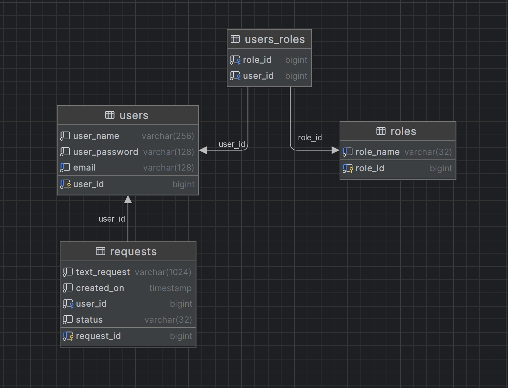

# Claim registrar

**Программа предназначена для регистрации и обработки пользовательских заявок.**

<u>***Возможности приложения:***</u>
- Создание заявки;
- Отправление заявки оператору на рассмотрение;
- Просмотр всех заявок с возможностью сортировки по дате и пагинацией по 5 элементов;
- Посмотреть заявку;
- Принять заявку;
- Отклонить заявку;
- Посмотреть список пользователей;
- Назначить права оператора.

**В приложении имеются следующие роли:**
- USER - имеет возможность создавать заявку, просматривать свои заявки с возможностью сортировки по дате и пагинацией ,
по 5 элементов, редактировать свою заявку (если находится в статусе черновик) и отправлять заявку на рассмотрение;
- OPERATOR - имеет возможность просматривать все отправленные на рассмотрение заявки с возможностью сортировки по дате 
и пагинацией по 5 элементов, принимать заявки, отклонять заявки;
- ADMIN - имеет возможность смотреть список пользователей, искать пользователя по имени/части имени, назначать права 
OPERATOR, удалить пользователя;

**Используемый стек: Java 11, Spring Boot, Spring Data JPA, Spring Security, Hibernate, Maven, PostgreSQL**

<u>***Для запуска приложения необходимо:***</u>
- Склонировать репозиторий на ПК в необходимую папку;
- Создать БД со следующими свойствами:
  - HOST: localhost;
  - PORT: 5432;
  - user и password см. в 
[application.properties](https://github.com/mikhailovPI/Claim-registrar/blob/main/ClaimRegistrar/src/main/resources/application.properties);
- Запустить файл 
[schema.sql](https://github.com/mikhailovPI/Claim-registrar/blob/main/ClaimRegistrar/src/main/resources/schema.sql);
- Произвести запуск приложения (class ClaimRegistrarApplication);
- Запустить Postman на [localhost:8080](http://localhost:8080);
- Запустить коллекцию 
[тестов](https://github.com/mikhailovPI/Claim-registrar/blob/main/ClaimRegistrar/info/ClaimRegistrar.postman_collection.json) в Postman;

***Схема базы данных:***
>
>
***Данные для тестирования в Postman:***
[tests](https://github.com/mikhailovPI/Claim-registrar/blob/main/ClaimRegistrar/info/ClaimRegistrar.postman_collection.json)

